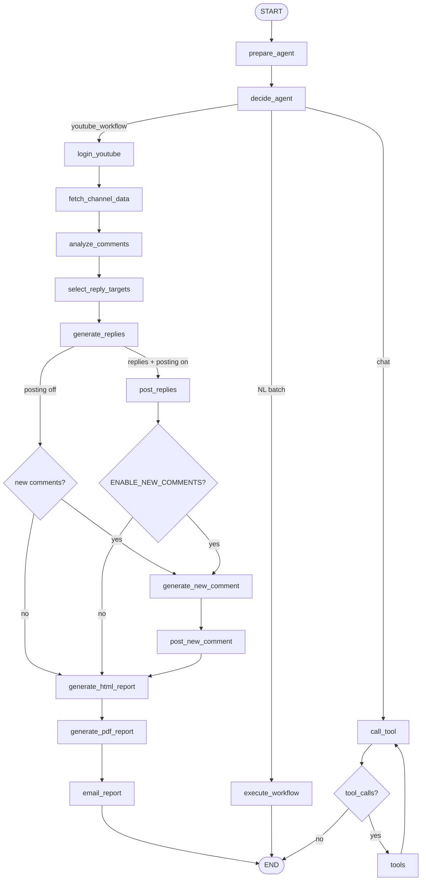
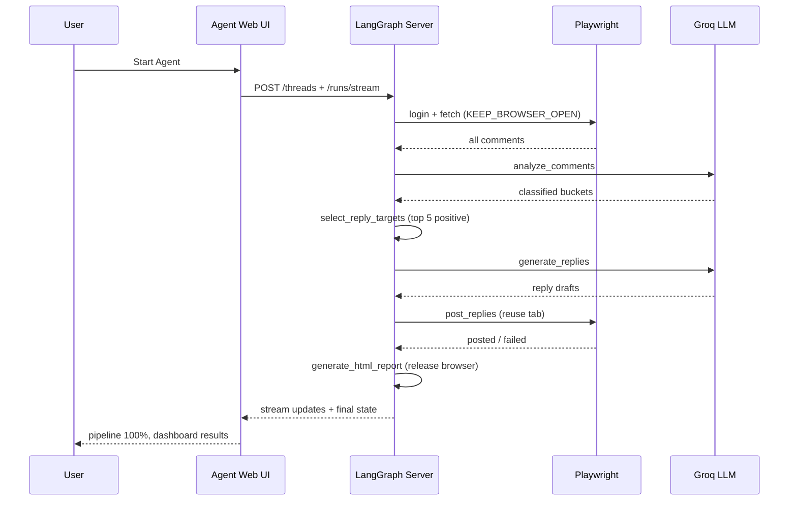

# YouTube Community Manager Agent — Workflow

This document explains how the **YouTube Community Manager Agent** works: login vs target channel, LangGraph graph structure, UI ↔ backend connection, browser lifecycle, reply target selection, routing, state management, and end-to-end flows.

---

## 1. Core concept: Login account vs target channel

| Concept | `.env` variables | What happens |
|---------|------------------|--------------|
| **Login account** | `YOUTUBE_EMAIL`, `YOUTUBE_PASSWORD` | Playwright signs into YouTube. Session saved to `./data/youtube_session.json`. |
| **Target channel** | `YOUTUBE_CHANNEL_NAME`, `YOUTUBE_CHANNEL_URL` | Agent navigates to this channel (any channel on YouTube). |
| **Work surface** | Latest video | All scraping, analysis, replies, and reporting happen on the **most recent upload**. |

```
┌─────────────────────────────────────────────────────────────────────────┐
│                         AGENT EXECUTION FLOW                            │
├─────────────────────────────────────────────────────────────────────────┤
│  STEP 1 — LOGIN          YOUTUBE_EMAIL / YOUTUBE_PASSWORD              │
│  STEP 2 — CHANNEL        YOUTUBE_CHANNEL_NAME or URL                    │
│  STEP 3 — LATEST VIDEO   Open newest upload on Videos tab               │
│  STEP 4 — PIPELINE       Scrape ALL → Analyze ALL → Select top N       │
│                          positive → Generate replies → Post (optional)  │
│                          → HTML report (closes browser) → PDF → Email │
└─────────────────────────────────────────────────────────────────────────┘
```

---

## 2. Architecture: Frontend + LangGraph backend

The **primary UI** is a React app in `frontend/`. It does **not** import the Python graph directly — it calls the **LangGraph Server** over HTTP and streams run events.

```
┌──────────────────┐     POST /threads                    ┌─────────────────────┐
│  Agent Web UI    │ ──▶ POST /threads/{id}/runs/stream ─▶│  LangGraph Server   │
│  localhost:5173  │     streamMode: updates, events,     │  localhost:2024     │
│  frontend/       │     values                           │  graph: agent       │
└──────────────────┘                                      └─────────────────────┘
         │                                                          │
         │  agentClient.ts (@langchain/langgraph-sdk)               │
         │  useAgentRun.ts → live pipeline steps                     ▼
         │                                                  Playwright + Groq + .env
```

### Connection layer (`frontend/src/lib/agentClient.ts`)

| Step | API | Purpose |
|------|-----|---------|
| Health | `GET /ok` | Sidebar shows LangGraph online/offline |
| Create thread | `POST /threads` | One thread per agent run |
| Stream run | `POST /threads/{id}/runs/stream` | Real-time node progress |

**Graph input** (per run from UI):

```json
{
  "messages": [],
  "user_input": "Analyze YouTube channel latest video comments for @Channel ...",
  "youtube_channel_name": "@Channel",
  "youtube_channel_url": "https://www.youtube.com/@Channel",
  "workflow_action": "email",
  "max_replies_per_video": 5,
  "email_recipient": "you@example.com"
}
```

`prepare_agent` applies `max_replies_per_video` and `email_recipient` as per-run env overrides via `config.apply_runtime_overrides()`.

### Local vs production

| Mode | `VITE_LANGGRAPH_API_URL` | Notes |
|------|--------------------------|-------|
| Local (direct) | `http://127.0.0.1:2024` | CORS enabled in `langgraph.json` |
| Local (proxy) | empty → `/api` | Vite proxies to `LANGGRAPH_PORT` |
| Production | `https://your-langgraph-server` | Build `frontend/dist` and host separately |

### Legacy UI

`streamlit_ui.py` still works via `./start.sh streamlit` — it invokes the graph in-process (no LangGraph Server required for that UI only).

---

## 3. LangGraph node flow

### Graph nodes (LangSmith Studio)

| Node | Role |
|------|------|
| `prepare_agent` | Normalize input, apply per-run overrides, bootstrap messages |
| `decide_agent` | Route: YouTube pipeline vs `execute_workflow` vs general chat |
| `login_youtube` | Verify/sign in via Playwright session |
| `fetch_channel_data` | Open target channel → latest video → scrape comments |
| `analyze_comments` | LLM-classify **every** scraped comment |
| `select_reply_targets` | Rank and pick top N **positive** comments |
| `generate_replies` | Humorous AI reply drafts for selected targets |
| `post_replies` | Browser posting when `ENABLE_COMMENT_REPLIES=true` |
| `generate_new_comment` | AI top-level comment when `ENABLE_NEW_COMMENTS=true` |
| `post_new_comment` | Post new comment when enabled |
| `generate_html_report` | HTML dashboard; **releases browser session** |
| `generate_pdf_report` | PDF community report |
| `email_report` | Email HTML + PDF when `EMAIL_REPORTS=true` |
| `execute_workflow` | Batch mode for natural-language requests |
| `call_tool` / `tools` | General chat + PDF/email tools |

### Mermaid diagram (main pipeline)



### Conditional routing

**After `generate_replies`** (`route_after_generate_replies`):

| Condition | Next node |
|-----------|-----------|
| `ENABLE_COMMENT_REPLIES=true` and replies generated | `post_replies` |
| `ENABLE_NEW_COMMENTS=true` (and posting skipped or done) | `generate_new_comment` |
| Otherwise | `generate_html_report` |

**After `post_replies`** (`route_after_post_replies`):

| Condition | Next node |
|-----------|-----------|
| `ENABLE_NEW_COMMENTS=true` | `generate_new_comment` |
| Otherwise | `generate_html_report` |

This ensures **no new comment is generated or posted** when `ENABLE_NEW_COMMENTS=false`.

---

## 4. Comment analysis vs reply selection

These are **separate steps** by design:

| Step | Scope | Config |
|------|-------|--------|
| `analyze_comments` | **All** scraped comments | `MAX_COMMENTS_PER_VIDEO=0` (all visible) |
| `select_reply_targets` | **Top N positive** only | `MAX_REPLIES_PER_VIDEO=5` (default) |

### Reply target eligibility (`comment_selection.py`)

A positive comment is eligible when:

- `category == "positive"`
- Not `agent_replied` / `posted` (our agent hasn't replied yet)
- Not `is_channel_owner` or channel author match
- Not `channel_replied` (channel already replied in that thread)
- Not pinned

Ranking score: `likes × 10 + sentiment × 5 + priority_boost`.

**Important:** `replied` on scrape is **not** used to exclude targets. Only `channel_replied` and `agent_replied` gate selection. This prevents false “0 targets” when YouTube marks threads inconsistently.

Fallback: if `reply_targets` is empty but positive comments exist, `execute_generate_replies` and the HTML report re-run selection.

---

## 5. Browser session lifecycle

| Phase | Browser state |
|-------|---------------|
| `fetch_channel_data` | Opens Chrome, scrapes, stores session in `_BROWSER_SESSION` when `KEEP_BROWSER_OPEN=true` |
| `post_replies` / `post_new_comment` | Reuses same tab via `prepare_browser_for_posting()` |
| `generate_html_report` | `release_browser_session()` — Chrome closes **here** |
| PDF / email | No browser needed |

Set in `.env`:

```env
KEEP_BROWSER_OPEN=true
BROWSER_HEADLESS=false   # recommended while debugging posting
```

---

## 6. State fields

| Field | Purpose |
|-------|---------|
| `messages` | Chat history |
| `user_input` | Prompt for the run |
| `workflow_action` | `analyze`, `report`, or `email` |
| `youtube_channel_name` / `youtube_channel_url` | Target channel |
| `max_replies_per_video` | Per-run override from UI |
| `email_recipient` | Per-run override for `GMAIL_DEFAULT_RECIPIENT` |
| `comments` / `analyzed_comments` | Raw and classified comments |
| `positive_comments` … `spam_comments` | Category buckets |
| `reply_targets` | Top N positive comments selected for replies |
| `generated_replies` | AI reply drafts |
| `failed_replies` | Replies that failed to post (`post_error`) |
| `generated_new_comments` | Top-level comment drafts (when enabled) |
| `reply_statistics` | Counts: generated, posted, failed, targets selected |
| `html_path` / `pdf_path` | Report file paths |
| `llm_summary` | Executive summary in HTML dashboard |
| `task_plan_summary` | Plan text from `decide_agent` |
| `logged_in` | YouTube session status |

---

## 7. Agent Web UI

### Pipeline steps (streamed live)

| Step | Graph node(s) | Emoji |
|------|---------------|-------|
| Agent Planning | `prepare_agent`, `decide_agent` | 🧠 |
| YouTube Login | `login_youtube` | 🔐 |
| Scrape Comments | `fetch_channel_data` | 📥 |
| Analyze Sentiment | `analyze_comments` | 🔍 |
| Select Reply Targets | `select_reply_targets` | 🎯 |
| Generate Replies | `generate_replies` | ✍️ |
| Post Replies | `post_replies` | 💬 |
| New Video Comment | `generate_new_comment`, `post_new_comment` | 📝 |
| HTML Dashboard | `generate_html_report` | 📊 |
| PDF Report | `generate_pdf_report` | 📄 |
| Email Delivery | `email_report` | 📧 |

Streaming uses LangGraph `updates` (node completed) + `events` (`on_chain_start` → step shows **running** immediately).

### UI controls

- **▶️ Start Agent** — full pipeline (analyze → replies → reports → email)
- **⏹️ Stop Agent** — abort stream
- **Max replies** — maps to `max_replies_per_video` (min 1)
- **Email recipient** — maps to `email_recipient` for that run

---

## 8. Example workflows

### A. Full agent run (primary — Agent Web UI)

```
User: Start Agent on @OldeWorldMelodies, max replies = 5
  │
  ▼
prepare_agent → decide_agent → login_youtube
  │
  ▼
fetch_channel_data     → scrape all comments (browser stays open)
analyze_comments       → 8 positive, 1 negative, etc.
select_reply_targets   → top 5 positive viewer comments
generate_replies       → 5 humorous drafts
post_replies           → post when ENABLE_COMMENT_REPLIES=true
  │
  ▼
(skip new comment when ENABLE_NEW_COMMENTS=false)
  │
  ▼
generate_html_report   → close browser, write ./reports/*_dashboard_report.html
generate_pdf_report → email_report
```



### B. Analyze only (replies generated, not posted)

```env
ENABLE_COMMENT_REPLIES=false
```

Pipeline runs through `generate_replies` but skips `post_replies` posting; drafts appear in HTML report.

### C. New comments disabled

```env
ENABLE_NEW_COMMENTS=false
```

Graph routes **directly** from `post_replies` (or `generate_replies`) to `generate_html_report` — no LLM call for new top-level comments.

---

## 9. File map

```
YouTube-Community-Management-Agent-/
├── README.md
├── AgentWorkflow.md              ← This file
├── frontend/                     ← Agent Web UI
│   ├── src/lib/agentClient.ts    ← LangGraph connection
│   ├── src/lib/streamProgress.ts ← Pipeline step streaming
│   └── src/hooks/useAgentRun.ts
├── streamlit_ui.py               ← Legacy UI
├── langgraph.json                ← graph id + CORS
├── start.sh / setup.sh
├── .env.example
│
└── src/agent/
    ├── graph.py
    ├── config.py                 ← apply_runtime_overrides()
    ├── workflow_executor.py
    ├── task_planner.py
    ├── routing.py
    └── custom_tools/
        ├── youtube_tools.py      ← scrape, post, browser session
        ├── comment_selection.py  ← top positive targets
        ├── comment_analyzer.py
        ├── reply_generator.py
        ├── new_comment_generator.py
        ├── html_report_generator.py
        ├── pdf_generator.py
        └── email_tools.py
```

---

## 10. Commands

```bash
./start.sh both       # LangGraph :2024 + UI :5173
./start.sh server     # LangGraph only
./start.sh ui         # UI only (start server separately)
./start.sh streamlit  # Legacy Streamlit :8501
./start.sh stop

uv run pytest tests/ -q
cd frontend && npm run build
```

First-time setup:

```bash
cp .env.example .env
chmod +x setup.sh start.sh
./setup.sh
```

---

## 11. Environment variables (reference)

### Login & target

| Variable | Purpose |
|----------|---------|
| `YOUTUBE_EMAIL` / `YOUTUBE_PASSWORD` | Playwright login |
| `YOUTUBE_CHANNEL_NAME` / `YOUTUBE_CHANNEL_URL` | Target channel |

### Scraping & replies

| Variable | Default | Purpose |
|----------|---------|---------|
| `MAX_COMMENTS_PER_VIDEO` | `0` | `0` = all visible comments |
| `MAX_REPLIES_PER_VIDEO` | `5` | Top N positive reply targets |
| `REPLY_PERSONALITY` | `humorous` | Reply tone |
| `ENABLE_COMMENT_REPLIES` | `false` | Post replies on YouTube |
| `ENABLE_NEW_COMMENTS` | `false` | Generate/post top-level comment |
| `KEEP_BROWSER_OPEN` | `true` | Reuse Chrome through posting |
| `BROWSER_HEADLESS` | `true` | Headless Chromium |

### Email & services

| Variable | Purpose |
|----------|---------|
| `EMAIL_REPORTS` | Send reports via Gmail |
| `GMAIL_*` | SMTP credentials and default recipient |
| `LANGGRAPH_PORT` / `FRONTEND_PORT` | Local ports |
| `VITE_LANGGRAPH_API_URL` | Frontend → backend URL |

---

## 12. Debugging

| Symptom | Check |
|---------|-------|
| UI shows LangGraph offline | `./start.sh server` or `./start.sh both`; `curl http://127.0.0.1:2024/ok` |
| Pipeline stuck at 0% | Restart both services; check Activity Log for stream errors |
| 0 reply targets but many positive | Ensure `MAX_REPLIES_PER_VIDEO > 0`; check `channel_replied` on comments in report |
| Replies fail to post | `BROWSER_HEADLESS=false`; confirm login; see **Replies Failed** in HTML report |
| CORS errors | Use `/api` proxy locally or set CORS in `langgraph.json` |
| New comment still generated | Confirm `ENABLE_NEW_COMMENTS=false` and restart LangGraph |

---

## 13. Extending the workflow

1. Add tool logic in `custom_tools/`.
2. Add executor in `workflow_executor.py`.
3. Add graph node + edges in `graph.py` (update conditional routes if needed).
4. Add pipeline step in `frontend/src/lib/workflowSteps.ts`.
5. Add tests and update this document.

---

## 14. Publish to GitHub

Suggested repo name: **`youtube-community-manager-agent`**.

Deployment pattern: LangGraph Server (backend) + static `frontend/dist` (UI) with `VITE_LANGGRAPH_API_URL` pointing at your server.
